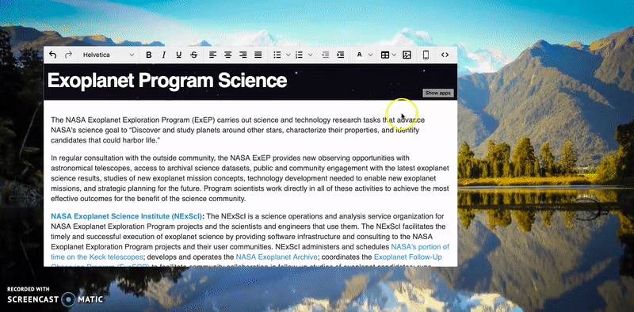

# Phone Preview
Draggable live phone preview modal for [Tinymce WYSIWYG editor]("https://www.tiny.cloud/").



To use this plugin copy the folder "phonepreview" and paste it into tinymce "plugins" folder in its source directory.
Here's the path for tinymce_5.2.0 self-hosted production release -> tinymce_5.2.0/tinymce/js/tinymce/plugins

Download any of tinymce self-hosted releases [here](https://www.tiny.cloud/get-tiny/self-hosted/).

## Tutorial
### Initializing
In order to have it in your editor, after including _phonepreview_ folder in your tinymce plugins directory, you must tell tinymce to inlcude the plugin as well as its toolbar toggle button as demonstrated bellow...
```javascript
tinymce.init({
    selector: "#target-element", // change this value according to your HTML target element selector
    toolbar: ["phonepreview"],
    plugins: ["phonepreview"],
});
```
### Plugin configuration
Configuration options provided:
* **css** -> Either an array of strings, each being a relative or remote path to a css file or a string of paths separed by any space character.
* **use_content_css** -> Boolean value that tells PhonePreview whether or not to use css extended into tinymce editor editing area;
* **layout**. _(coming soon)_

To set any of the options above, you first need to add the flowing object to your tinymce init configuration object:
```javascript
    tinymce.init({
        selector: "#target-element", // change this value according to your HTML target element selector
        toolbar: ["phonepreview"],
        plugins: ["phonepreview"],
        phone_preview: {
            // PhonePreview configuration goes here...
        }
    });
```
    
### Extending external CSS into PhonePreview
If you have already applied external CSS into tinymce editor by setting the [__content_css__](https://www.tiny.cloud/docs/configure/content-appearance/#content_css) property when initializing it, by default, the same CSS will be applied to PhonePreview. If for some reason you are applying css into tinymce editor editing area and do not want PhonePreview to make use of it, inlcude property __use_content_css__ to phone_preview configuration object and set it to false.
```javascript
    tinymce.init({
        selector: "#target-element", // change this value according to your HTML target element selector
        toolbar: ["phonepreview"],
        plugins: ["phonepreview"],
        content_css: "css/tinymceContentStyle.css" // resolved to http://domain.mine/css/tinymceContentStyle.css
        phone_preview: {
            use_content_css: false // telling PhonePreview not to use content_css
        }
    });
```
#### Extending multiple css files into PhonePreview
```javascript
    tinymce.init({
        selector: "#target-element", // change this value according to your HTML target element selector
        toolbar: ["phonepreview"],
        plugins: ["phonepreview"],
        content_css: "css/contentStyle.css" // resolved to http://domain.mine/css/contentStyle.css
        phone_preview: {
            css: ["css/style.css", "css/mobile.css", "css/animate.css"]
        }
        /*
         The following link elements will be appended to PhonePreview iframe component and in the following order:
         
         <link href="css/style.css" type="text/css" rel="stylesheet">
         <link href="css/mobile.css" type="text/css" rel="stylesheet"> 
         <link href="css/animate.css" type="text/css" rel="stylesheet"> 
         <link href="css/contentStyle.css" type="text/css" rel="stylesheet"> 
        */
    });
```

## Functionality
You can only open PhonePreview by clicking on its toggle button; however, you can close it by either clicking on its toggle button again or simply hitting the Escape key button (ESC).

PhonePreview is draggable. Just click on its frame, hold it and drag it around. You will soon notice that you cannot drag it off the screen - that's due to the fact that dragging PhonePreview has been limited to viewport size. 

Closing PhonePreview does not reset it to its initial position. As soon as you reopen it, it will be exactly where you left it. Reloading the whole page, however, will do just that.

Editing Tinymce content will automatically update PhonePreview content making it a LIVE phone preview component.

## Applying layout template into PhonePreview
Coming soon...

## Author
* [Melqui Brito](https://github.com/melquibrito)

## License
This project is licensed under the __MIT License__ - see the [LICENSE](LICENSE.md) file for more details.
